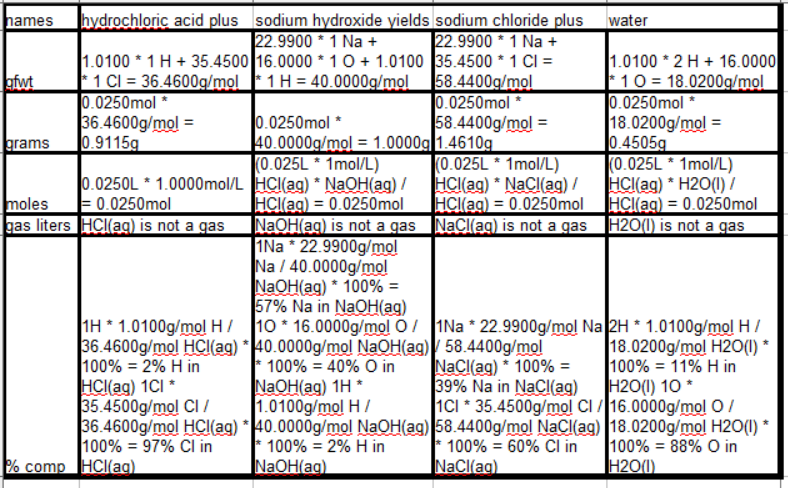
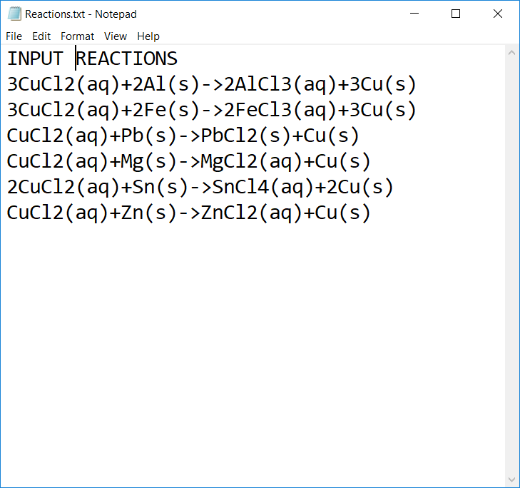
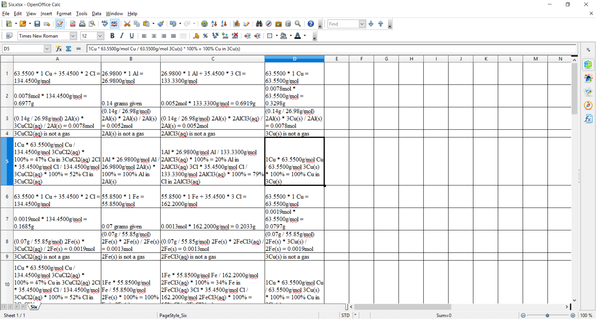

# `Labatron`
Chemical stochiometric calculator

Labatron takes in information using the console and outputs a .csv containing (Mrs. Restivo style) work shown for Chemistry class. Input equations in form "X+Y->A+B". with optional physical state indicators yield a fully worked out stochiometry equation. Example: "CH4(g)+2O2(g)->2H2O(l)+CO2(g)". I can't remember receiving less then a perfect score on any labs I used this program on!

